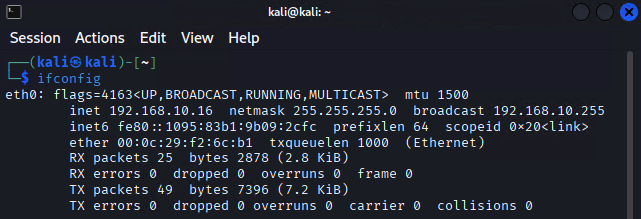
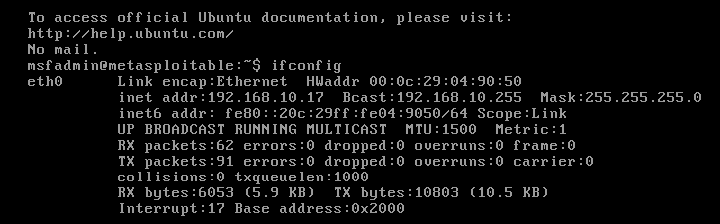

## 📋 Pré-requisitos

- VMware Workstation  
- Conhecimento básico de Linux e redes
- Compreensão dos aspectos éticos de testes de penetração

## 🔧 Configuração do Ambiente

### Configuração das Máquinas Virtuais

1. **Kali Linux** (Atacante)
   - Configurar adaptador de rede em modo Host-Only
   - IP: 192.10.16

2. **Metasploitable 2** (Alvo)
   - Configurar adaptador de rede em modo Host-Only
   - IP: 192.168.10.17
   
